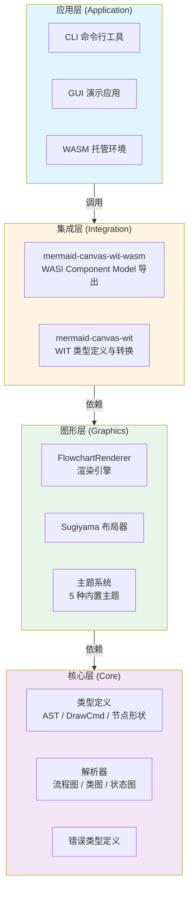
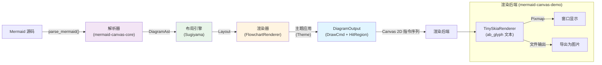
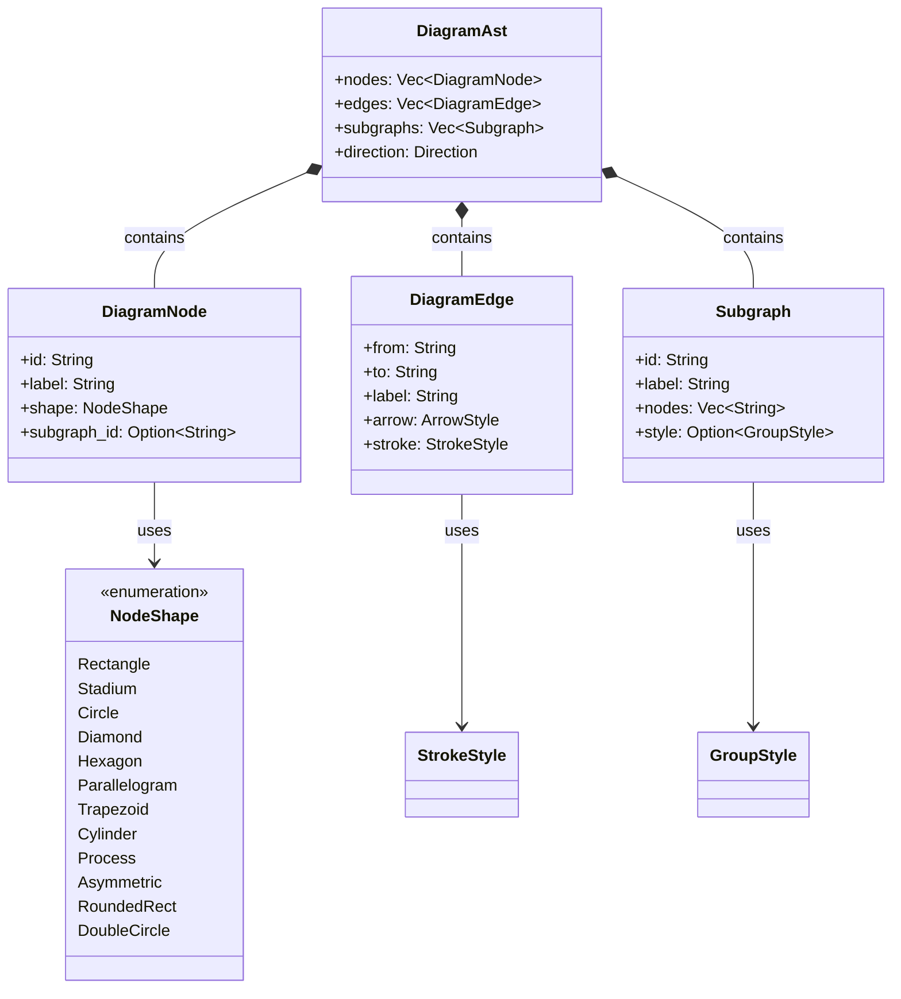
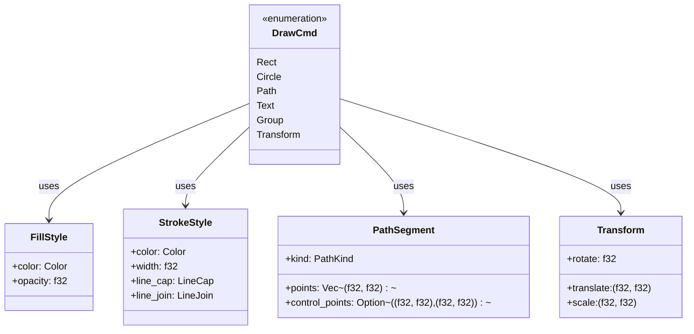
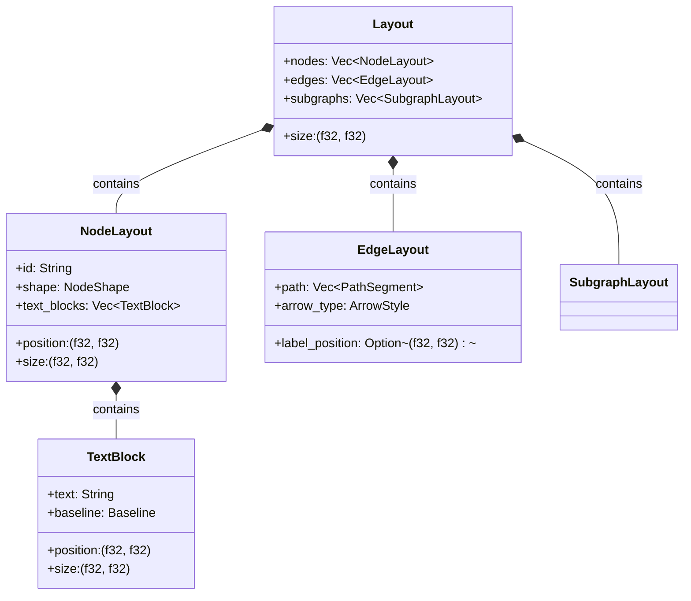
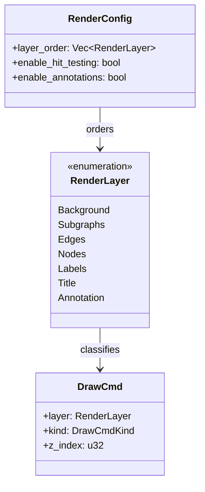
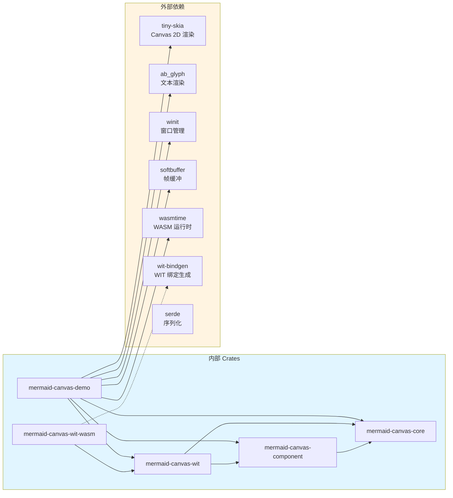

# mermaid-canvas-rs 架构设计

## 分层总览

mermaid-canvas-rs 采用四层架构设计，从应用层到核心层单向依赖，实现后端无关的 Canvas 2D 渲染。

**层间交互原则**：
- 应用层只集成层接口通信，不直接访问图形层或核心层
- 集成层将 WIT 类型转换为内部类型，屏蔽 WASM 细节
- 图形层实现布局和渲染逻辑，不感知输出格式（WASM / 本地）
- 核心层提供纯数据结构和解析能力，无任何渲染相关逻辑

---

## Crate 职责

| Crate | 职责 | 关键导出 |
|-------|------|----------|
| **mermaid-canvas-core** | 类型定义、解析器、错误类型 | `DiagramAst`, `DrawCmd`, `NodeShape`, `parse_mermaid`, `ParseError` |
| **mermaid-canvas-component** | 布局引擎、渲染器、主题系统 | `FlowchartRenderer`, `Layout`, `Theme`, `LayoutConfig`, 5 种主题实现 |
| **mermaid-canvas-wit** | WIT 类型定义、类型转换、lib_mode API | `WitDrawCmd`, `WitLayer`, `WitRenderResult`, `render()` |
| **mermaid-canvas-wit-wasm** | WASI Component Model 导出、Guest traits 实现 | `WIT 接口实现`, `wit-bindgen` 生成的绑定 |
| **mermaid-canvas-demo** | 渲染后端实现、应用入口 | `TinySkiaRenderer`, `DemoApp`, `WasmHost`, CLI 工具 |

---

## 渲染管线

完整的渲染流程从 Mermaid 源码到最终像素输出的数据流。

**关键数据结构转换**：
1. `DiagramAst` → `Layout`：解析后的抽象语法树转换为带坐标的布局信息
2. `Layout` + `Theme` → `Vec<DrawCmd>`：布局和主题组合生成绘制指令
3. `Vec<DrawCmd>` → `WitRenderResult`：内部绘制指令扁平化为 WIT 兼容格式
4. `WitRenderResult` → Canvas 绘制：后端执行绘制指令产生像素

---

## 核心数据类型

### AST 层类型

### DrawCmd 绘制指令

### 布局类型

### 渲染层级系统

---

## 主题系统

mermaid-canvas-rs 采用基于语义槽位的主题系统，将节点形状映射到语义颜色槽位，实现一致的视觉语义表达。

### 语义槽位映射表

| 节点形状 (NodeShape) | 语义槽位 | 用途 |
|---------------------|----------|------|
| Rectangle, Stadium, RoundedRect | primary | 主流程节点，表示核心业务逻辑 |
| Diamond, Hexagon | secondary | 条件判断、分支点，表示决策节点 |
| Circle, DoubleCircle | accent | 起始、结束节点，表示关键里程碑 |
| Parallelogram, Trapezoid | info | 输入、输出节点，表示数据流动 |
| Cylinder, Process | data | 存储节点，表示数据持久化 |
| Asymmetric | special | 特殊形状节点，表示异常或特殊处理 |

### 内置主题

| 主题 | Primary | Secondary | Accent | Info | Data | Special |
|------|---------|-----------|--------|------|------|---------|
| DefaultTheme | #f8f8f2 | #f92672 | #66d9ef | #a6e22e | #ae81ff | #fd971f |
| DarkTheme | #272822 | #f92672 | #66d9ef | #a6e22e | #ae81ff | #fd971f |
| ForestTheme | #e8f5e9 | #4caf50 | #2196f3 | #ff9800 | #9c27b0 | #f44336 |
| NordicTheme | #eceff4 | #81a1c1 | #88c0d0 | #ebcb8b | #b48ead | #bf616a |
| CappuccinoTheme | #fdf6e3 | #cb4b16 | #268bd2 | #2aa198 | #6c71c4 | #dc322f |

**主题扩展**：通过实现 `Theme` trait 可以自定义主题，每个槽位对应一个 `Color` 值。

---

## 依赖关系

**外部依赖分类**：

| 类别 | 库 | 用途 | 约束 |
|------|------|------|------|
| 渲染后端 | tiny-skia | CPU Canvas 2D 渲染 | 无 GPU 依赖 |
| 文本处理 | ab_glyph | 字体加载和文本光栅化 | 支持 TrueType/OpenType |
| GUI 框架 | winit, softbuffer | 跨平台窗口和帧缓冲 | 仅用于 Demo |
| WASM 运行时 | wasmtime | WASI Component Model 运行时 | 0.57+ 版本 |
| 绑定生成 | wit-bindgen | WIT 到 Rust 绑定生成 | 0.57 版本 |
| 序列化 | serde | JSON/YAML 序列化支持 | 可选功能 |

---

## 设计决策

| 决策 | 选择 | 理由 | 备选方案 |
|------|------|------|----------|
| **输出格式** | Canvas 2D 指令序列 | 后端无关，易于适配不同渲染引擎（Canvas API、Skia、WASM） | 直接输出位图、SVG、PDF |
| **布局算法** | Sugiyama 分层布局 | 流程图家族的标准算法，支持正交边、交叉最小化、层次紧凑 | 力导向布局、圆形布局、树形布局 |
| **主题系统** | 基于形状的语义槽位 | 形状即语义，颜色自动跟随语义，减少用户配置复杂度 | 基于节点 ID 映射、基于层级映射 |
| **WIT 编码** | 扁平化结构，无递归类型 | WASI Component Model 限制，避免复杂类型系统导致的绑定生成问题 | 嵌套结构、递归类型 |
| **文本渲染** | ab_glyph | 无系统字体依赖，跨平台一致，支持文本对齐和度量 | system-fonts-loader (平台相关)、rusttype (已废弃) |
| **WASM 模型** | WASI Component Model | 标准化、跨语言、组件化，比传统 Emscripten 更轻量 | Emscripten (C++ 工具链)、wasm-bindgen (浏览器专用) |
| **错误处理** | 分层错误类型 | 每个模块定义自己的错误，在边界转换，避免内部错误泄漏 | 统一错误类型 (耦合严重)、Result<Box<dyn Error>> (类型信息丢失) |
| **图层系统** | 固定 7 层 + Z-index | 常见图层语义明确，避免运行时动态图层的复杂性 | 完全动态图层 (灵活但不可预测)、单图层 (无语义) |

### 非功能性目标

| 维度 | 目标 | 达成方案 |
|------|------|----------|
| **性能** | 1000 节点图表 < 100ms | Sugiyama 布局 O(n³) 实际表现优秀，Canvas 指令解析 O(n) |
| **可用性** | 解析错误消息清晰，包含行列号 | `ParseError` 包含 `span: Span`，格式化错误输出 |
| **可扩展性** | 新增节点类型无需修改布局核心 | `NodeShape` 枚举可扩展，布局器通过 trait 多态处理 |
| **可观测性** | 布局统计、指令计数、内存分配 | 开发模式下输出 `LayoutStats` 和 `RenderStats` |

---

## 架构评估概要

| 维度 | 状态 | 风险等级 |
|------|------|---------|
| 分层设计 | ✅ | 无 |
| 模块边界 | ✅ | 无 |
| 错误隔离 | ✅ | 无 |
| 技术选型 | ✅ | 无 |
| 性能目标 | ✅ | 低 |
| 可扩展性 | ✅ | 无 |

**结论**：架构设计清晰，分层明确，依赖单向，无循环依赖。采用标准化的 WASI Component Model 和后端无关的 Canvas 指令序列，具有良好的可移植性和扩展性。主题系统基于语义槽位设计，用户体验友好且易于扩展。
