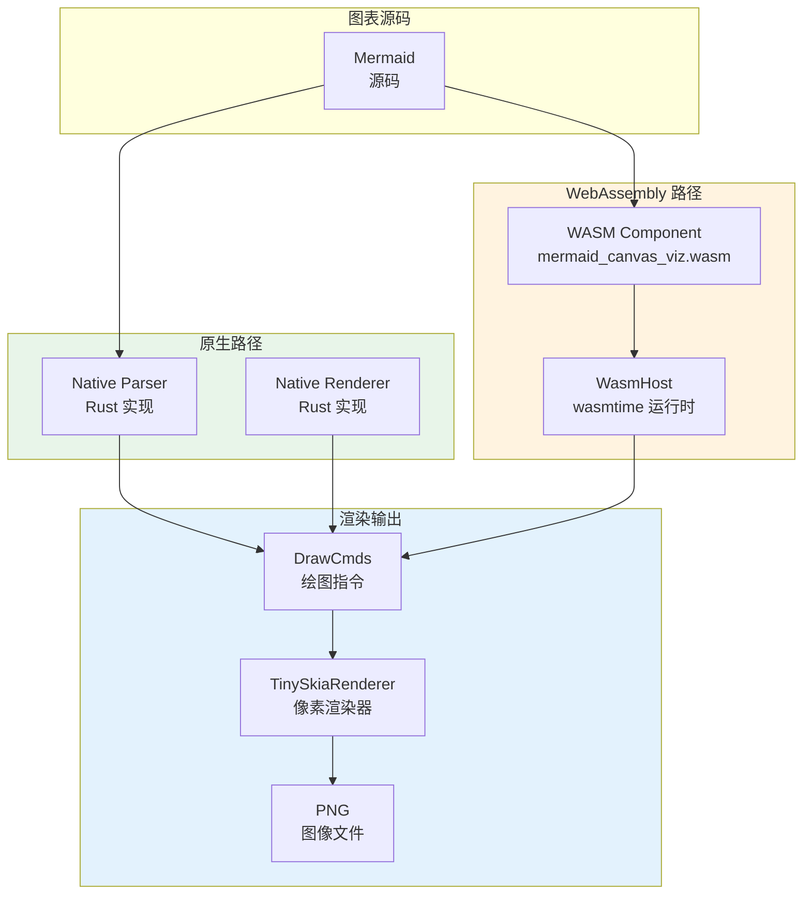

# Demo 演示

mermaid-canvas-rs 提供多个演示程序，展示不同类型的 Mermaid 图表渲染能力，支持原生和 WebAssembly 两种运行模式。

## 运行 Demo

### 基础类型演示

**流程图（Flowchart）**
```bash
cargo run --release --bin demo-flowchart
```

**类图（Class Diagram）**
```bash
cargo run --release --bin demo-class
```

**状态图（State Diagram）**
```bash
cargo run --release --bin demo-state
```

**实体关系图（ER Diagram）**
```bash
cargo run --release --bin demo-er
```

**需求图（Requirement Diagram）**
```bash
cargo run --release --bin demo-requirement
```

**数据包图（Packet Diagram）**
```bash
cargo run --release --bin demo-packet
```

### 主题演示

**多主题对比**
```bash
cargo run --release --bin demo-themes
```

## CLI 参数

所有演示程序支持以下命令行参数：

| 参数 | 类型 | 说明 | 默认值 |
|------|------|------|--------|
| `--theme <name>` | 字符串 | 指定渲染主题 | `default` |
| `--output <path>` | 路径 | 输出 PNG 文件路径 | `<name>.png` |
| `--wasm <path>` | 路径 | 使用 WebAssembly 组件运行 | 无（原生模式） |

**可用主题**：
- `default` - 默认主题
- `forest` - 森林主题
- `dark` - 暗色主题
- `neutral` - 中性主题

### 示例用法

```bash
# 使用暗色主题渲染流程图
cargo run --release --bin demo-flowchart -- --theme dark --output flowchart-dark.png

# 使用 WebAssembly 组件渲染类图
cargo run --release --bin demo-class -- --wasm target/wasm32-wasip2/release/mermaid_canvas_viz.wasm

# 保存森林主题的状态图
cargo run --release --bin demo-state -- --theme forest --output state-forest.png
```

## 双路径架构



### 原生路径优势

- **性能最佳**：零运行时开销，直接调用 Rust 函数
- **调试便捷**：完整的符号信息和调试支持
- **开发友好**：快速迭代，无需重新编译 WASM 组件

### WebAssembly 路径优势

- **跨平台**：一次编译，多平台运行
- **安全隔离**：在沙箱环境中运行，内存安全
- **动态加载**：运行时加载不同版本的组件

## WASM 渲染路径

### 步骤 1：编译组件

```bash
cargo build --release --target wasm32-wasip2
```

输出：`target/wasm32-wasip2/release/mermaid_canvas_viz.wasm` (~1.7MB)

### 步骤 2：运行 WASM 模式

```bash
cargo run --release --bin demo-flowchart \
  -- --wasm target/wasm32-wasip2/release/mermaid_canvas_viz.wasm \
     --theme forest \
     --output flowchart-wasm.png
```

### 步骤 3：输出对比

原生和 WASM 路径生成的像素级输出完全一致，可通过图像差异工具验证：

```bash
# 使用 ImageMagick 对比
compare flowchart-native.png flowchart-wasm.png diff.png

# 如果完全相同，diff.png 将为全黑色
```

## 多主题对比

`demo-themes` 程序生成同一图表在不同主题下的渲染效果。

### 运行命令

```bash
cargo run --release --bin demo-themes -- --output themes-comparison
```

### 生成文件

```
themes-comparison-default.png  # 默认主题
themes-comparison-forest.png   # 森林主题
themes-comparison-dark.png     # 暗色主题
themes-comparison-neutral.png  # 中性主题
```

### 主题差异

| 主题 | 背景色 | 线条颜色 | 文字颜色 | 适用场景 |
|------|--------|----------|----------|----------|
| Default | 白色 | 黑色 | 黑色 | 通用场景，打印友好 |
| Forest | 浅绿 | 深绿 | 深绿 | 自然、生物领域 |
| Dark | 深灰 | 浅色 | 浅色 | 暗色界面、夜间模式 |
| Neutral | 灰白 | 深灰 | 深灰 | 技术文档、专业展示 |

## 渲染器

mermaid-canvas-rs 使用 TinySkiaRenderer 将绘图指令转换为像素级输出。

### DrawCmd 到 tiny-skia 映射

| DrawCmd | tiny-skia 操作 | 说明 |
|---------|----------------|------|
| BeginPath | `PathBuilder::new()` | 开始新路径 |
| MoveTo | `path.move_to(x, y)` | 移动画笔 |
| LineTo | `path.line_to(x, y)` | 绘制直线 |
| QuadCurve | `path.quad_to(cx, cy, x, y)` | 二次贝塞尔曲线 |
| CubicCurve | `path.cubic_to(c1x, c1y, c2x, c2y, x, y)` | 三次贝塞尔曲线 |
| ClosePath | `path.close()` | 闭合路径 |
| Fill | `paint.set_fill_color()` + `canvas.fill_path()` | 填充路径 |
| Stroke | `paint.set_color()` + `canvas.stroke_path()` | 描边路径 |
| Text | `canvas.fill_text()` | 绘制文本 |
| Clip | `canvas.clip_path()` | 裁剪区域 |

### TinySkiaRenderer 能力表

| 功能 | 支持 | 说明 |
|------|------|------|
| 二维路径 | ✅ | 直线、曲线、闭合路径 |
| 文本渲染 | ✅ | 多种对齐方式和基线 |
| 裁剪 | ✅ | 复杂的裁剪区域 |
| 抗锯齿 | ✅ | 高质量边缘渲染 |
| 透明度 | ✅ | 支持 RGBA 颜色 |
| 输出格式 | ✅ | PNG（支持 Alpha 通道） |

### 性能特性

- **增量渲染**：只重绘变化的部分
- **批量绘制**：优化相同属性的绘制操作
- **内存效率**：共享像素缓冲区，减少内存分配
- **可并行**：多个图表可并行渲染（独立渲染器实例）

## 交互测试

部分演示程序支持鼠标交互测试：

```bash
cargo run --release --bin demo-flowchart
```

程序启动后：
1. 显示渲染后的图表窗口
2. 鼠标悬停时高亮对应的图形元素
3. 点击元素输出元素 ID 和位置信息
4. 输出命中测试结果到控制台

## 高级用法

### 自定义图表

修改演示程序中的 Mermaid 源码字符串：

```rust
// demo-flowchart/src/main.rs
let source = r#"
graph LR
    A[自定义节点] --> B[另一个节点]
    B --> C{决策点}
    C -->|分支1| D[结果1]
    C -->|分支2| E[结果2]
"#;
```

### 批量处理

编写脚本批量处理多个图表：

```bash
#!/bin/bash
for file in examples/*.mmd; do
    name=$(basename "$file" .mmd)
    cargo run --release --bin demo-custom \
      -- --source "$file" \
         --output "output/$name.png" \
         --theme default
done
```

### 性能测试

使用 `time` 命令测量渲染时间：

```bash
# 原生模式
time cargo run --release --bin demo-flowchart -- --theme default

# WASM 模式
time cargo run --release --bin demo-flowchart \
  -- --wasm target/wasm32-wasip2/release/mermaid_canvas_viz.wasm
```

比较两种模式下的渲染性能差异。

## 故障排除

### WASM 加载失败

```
Error: Failed to load WASM component: ...
```

**解决方案**：
1. 确认 WASM 组件已编译：`ls target/wasm32-wasip2/release/`
2. 检查组件格式：`wasm-tools validate mermaid_canvas_viz.wasm`
3. 验证路径正确性：使用绝对路径或相对于执行目录的路径

### 主题未生效

```
Error: Unknown theme: custom-theme
```

**解决方案**：
1. 查看可用主题：`--help` 输出
2. 使用正确的主题名称（小写）
3. 确认主题在 `Theme` 枚举中定义

### 输出文件未生成

```
Error: Failed to write PNG: ...
```

**解决方案**：
1. 检查输出目录是否存在：`mkdir -p output/`
2. 确认写入权限：`ls -la output/`
3. 验证路径格式：避免特殊字符和空格
