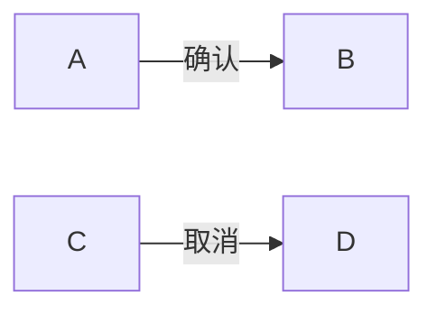
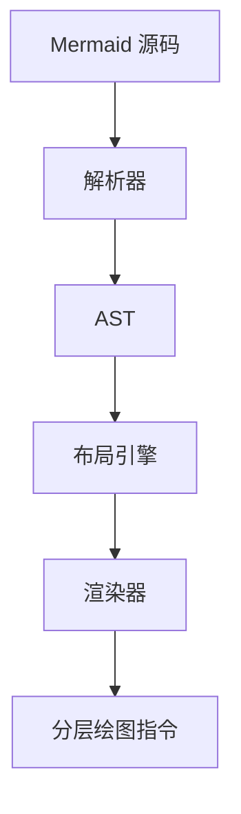
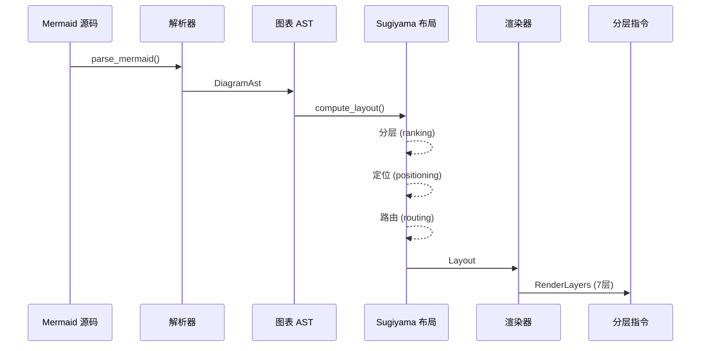

# 流程图 Flowchart

流程图是 mermaid-canvas-rs 的核心图表类型，支持多种节点形状、边样式和布局方向。通过 Sugiyama 分层布局算法自动计算节点位置，输出分层 Canvas 2D 绘图指令。

## 基本用法

```rust
use mermaid_canvas_wit;

let source = r#"
flowchart TD
    A[开始] --> B{判断}
    B -->|是| C[处理]
    B -->|否| D[结束]
    C --> D
"#;

let result = mermaid_canvas_wit::render(source, Some("forest"))?;

// result.layers — 分层绘图指令（7层）
// result.width, result.height — 画布尺寸
// 使用任意 Canvas 2D 后端渲染 result
```

## 支持的节点形状

| 形状 | Mermaid 语法 | 描述 |
|------|--------------|------|
| Rectangle | `[label]` | 矩形 - 标准流程节点 |
| RoundRect | `(label)` | 圆角矩形 - 更柔和的节点 |
| Stadium | `([label])` | 体育场形 - 起止点 |
| Circle | `((label))` | 圆形 - 连接点/标记 |
| DoubleCircle | `(((label)))` | 双圆 - 强调的连接点 |
| Diamond | `{label}` | 菱形 - 判断/分支 |
| Hexagon | `{{label}}` | 六边形 - 准备步骤 |
| Cylinder | `[(label)]` | 圆柱 - 数据存储 |
| Subroutine | `[[label]]` | 子程序 - 子流程调用 |
| Parallelogram | `[/label/]` | 平行四边形 - 输入输出 |
| Trapezoid | `[\label\]` | 梯形 - 手动操作 |
| Asymmetric | `>label]` | 不对称形 - 数据迁移 |

## 边的语法

### 箭头类型

```mermaid
flowchart LR
    A --> B     实线箭头
    C ---> D    粗实线箭头
    E -.-> F    虚线箭头
    G ==> H     双实线箭头
```

### 边标签



### 布局方向

| 方向 | 语法 | 描述 |
|------|------|------|
| Top-Down | `flowchart TD` | 自上而下（默认） |
| Left-Right | `flowchart LR` | 从左到右 |
| Right-Left | `flowchart RL` | 从右到左 |
| Bottom-Top | `flowchart BT` | 自下而上 |



## 渲染流程

mermaid-canvas-rs 采用纯 Rust 实现的渲染管道，从 Mermaid 源码到 Canvas 2D 指令的完整流程：



1. **解析器** (`parser`)：将 Mermaid 源码解析为中间表示 `DiagramAst`
2. **布局引擎** (`layout`)：使用 Sugiyama 算法计算节点和边的坐标
3. **渲染器** (`renderer`)：根据布局结果生成 Canvas 2D 绘图指令
4. **分层系统**：输出 7 个渲染层，支持脏标记和增量更新

## Sugiyama 布局

Sugiyama 分层布局算法将流程图转化为层次结构，确保边主要从上到下（或从左到右）流动。

### 三阶段布局

#### 1. 分层 (Ranking)

将节点分配到不同的层级，最小化边的交叉和回退。

```rust
// 节点按层级分组
let (ranks, rank_map) = ranking::assign_ranks(&ast);
// ranks: Vec<Vec<String>> — 每一层包含的节点 ID
// rank_map: HashMap<String, usize> — 节点到层级的映射
```

#### 2. 定位 (Positioning)

使用 **累计 Y 游标** 方式为每一层的节点分配 Y 坐标，然后使用 barycenter 启发式对每层节点排序以最小化边交叉。

```rust
let (nodes, total_w, total_h) = positioning::assign_positions(
    &ranks, &rank_map, ast, config, theme
);
// 每层节点的 Y 坐标 = 上一层的 Y + 上一层最大高度 + 层间距
```

#### 3. 路由 (Routing)

使用曼哈顿路由计算边的路径点，避免穿过节点。

```rust
let edges = routing::route_edges(
    &ast.edges, &nodes, &ranks, &rank_map, ast.direction
);
// 边由一系列贝塞尔曲线段或直线段组成
```

### 布局参数

通过 `LayoutConfig` 自定义布局参数：

```rust
use mermaid_canvas_component::LayoutConfig;

let config = LayoutConfig {
    node_spacing: 50.0,      // 同层节点间距
    rank_spacing: 80.0,      // 层间距
    ranking_passes: 3,       // 排序迭代次数
};
```

## 生成的绘图指令

渲染器输出分层绘图指令，每层包含一组 `DrawCmd`。7 个标准层按 z-index 顺序渲染：

| 层 | z-index | 包含的 DrawCmd 类型 |
|----|---------|-------------------|
| Background | 0 | `Rect` - 背景填充 |
| Subgraphs | 1 | `Group`, `Rect`, `Text` - 子图容器和标签 |
| Edges | 2 | `Path` - 连线（贝塞尔曲线或折线） |
| Nodes | 3 | `Rect`, `Circle`, `Path` - 节点形状 |
| Labels | 4 | `Text` - 节点和边标签 |
| Title | 5 | `Text` - 图表标题 |
| Annotations | 6 | `Text`, `Rect` - 标注信息 |

### DrawCmd 类型

```rust
pub enum DrawCmd {
    Rect { x, y, width, height, fill, stroke, corner_radius },
    Path { segments, fill, stroke },
    Circle { cx, cy, r, fill, stroke },
    Text { x, y, content, style, anchor, baseline },
    Group { label, items },
}
```

示例：渲染一个圆角矩形节点

```rust
DrawCmd::Rect {
    x: 100.0,
    y: 50.0,
    width: 120.0,
    height: 50.0,
    fill: Some(FillStyle::Color("#dae8fc")),
    stroke: Some(StrokeStyle::Color("#6c8ebf")),
    corner_radius: Some(8.0),
}
```

### PathSegment

边的路径由多个路径段组成：

```rust
pub enum PathSegment {
    MoveTo(f64, f64),
    LineTo(f64, f64),
    BezierTo(f64, f64, f64, f64, f64, f64),
    QuadraticTo(f64, f64, f64, f64),
    Arc(f64, f64, f64, f64, f64, bool),
    Close,
}
```

## 命中区域

交互功能通过命中测试 (hit test) 实现，返回被点击的元素索引。

```rust
use mermaid_canvas_wit::hit_test;

let result = mermaid_canvas_wit::render(source, None)?;
let index = hit_test(&result, x, y, 5.0); // 5px 容差

if let Some(node_id) = index {
    println!("点击了节点: {}", node_id);
}
```

### BoundingBox

每个节点和边都有一个包围盒用于快速命中测试：

```rust
pub struct BoundingBox {
    pub x: f64,
    pub y: f64,
    pub width: f64,
    pub height: f64,
}

// 扩展包围盒增加容差
let expanded = bounds.expand(10.0);

// 测试点是否在包围盒内
if bounds.contains(mouse_x, mouse_y) {
    // 命中
}
```

### 使用场景

- 工具提示显示节点信息
- 节点编辑对话框
- 边的方向重绘
- 拖放交互
- 超链接导航
