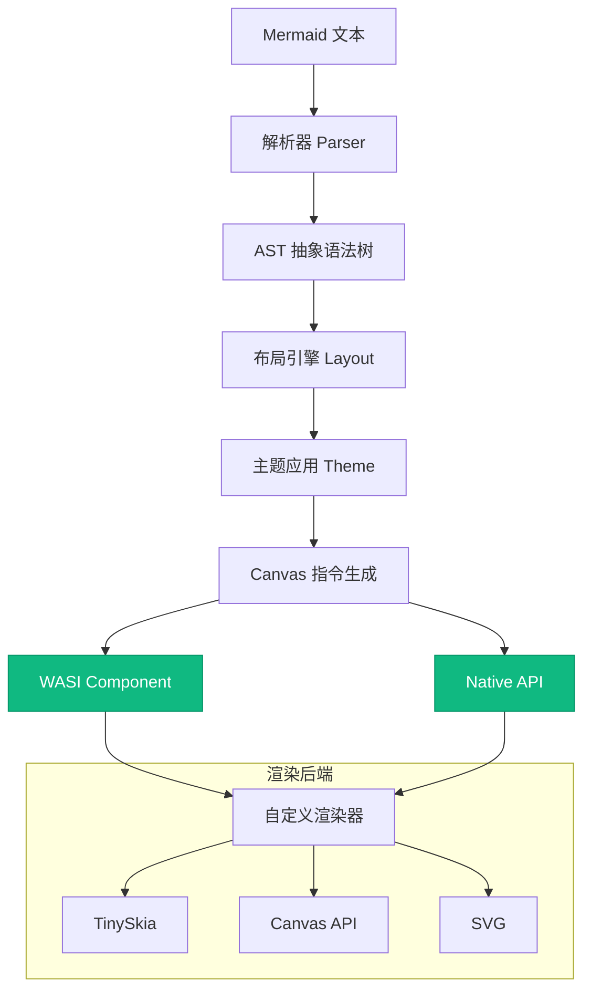

# mermaid-canvas-rs

**mermaid-canvas-rs** 是一个后端无关的 Rust Mermaid 图表渲染库，专为 WASI Component Model 设计。它将 Mermaid 图表解析并转换为 Canvas 2D 指令序列，可以对接任意渲染后端（如 TinySkia、Canvas API、SVG 等）。

## 核心特性

- **后端无关设计**：输出标准化的 Canvas 2D 指令序列，支持任意渲染器
- **WASI Component Model 原生支持**：编译为 wasm32-wasip2 目标，体积约 1.7MB
- **完整图表类型支持**：涵盖 6 种主流 Mermaid 图表类型
- **Sugiyama 布局引擎**：内置分层布局算法，优化图表可读性
- **丰富的主题系统**：提供 5 种内置主题，支持自定义主题配置
- **高测试覆盖率**：180+ 测试用例，确保渲染准确性
- **模块化架构**：5 个独立 crate，便于按需集成

## 架构概览



## 支持的图表类型

| 图表类型 | 说明 | 状态 |
|---------|------|------|
| Flowchart | 流程图 | ✅ 完全支持 |
| Class | 类图 | ✅ 完全支持 |
| State | 状态图 | ✅ 完全支持 |
| ER | 实体关系图 | ✅ 完全支持 |
| Requirement | 需求图 | ✅ 完全支持 |
| Packet | 包图（序列占位） | 🚧 开发中 |

## 快速开始

### Native 使用方式

最简单的方式是通过 `mermaid_canvas_wit` crate 直接在 Rust 项目中渲染图表：

```rust
use mermaid_canvas_wit;

fn main() -> Result<(), Box<dyn std::error::Error>> {
    let mermaid_code = "flowchart TD\n    A[Start] --> B{Choice?}\n    B -->|yes| C[Action]\n    B -->|no| D[End]";

    let result = mermaid_canvas_wit::render(
        mermaid_code,
        None,  // 使用默认主题
    )?;

    // result.layers — 分层绘图指令
    // result.width, result.height — 画布尺寸
    // result.layers 中的 WitDrawCmd 可对接任意渲染器

    println!("Canvas 尺寸: {}x{}", result.width, result.height);
    println!("指令层数: {}", result.layers.len());

    Ok(())
}
```

**Cargo.toml 依赖：**

```toml
[dependencies]
mermaid-canvas-wit = "0.1"
```

### WASI Component 集成

编译为 WASI Component 后，可以在任何支持 WASI 的环境中使用：

```bash
# 编译 WASI Component (~1.7MB release)
cargo build -p mermaid-canvas-wit-wasm --target wasm32-wasip2 --release

# 编译成功后，组件位于：
# target/wasm32-wasip2/release/mermaid_canvas_wit_wasm.wasm
```

**使用 wasmtime 宿主加载：**

```bash
# 使用内置演示程序加载 WASM 组件
cargo run --bin demo-flowchart -- --wasm target/wasm32-wasip2/release/mermaid_canvas_wit_wasm.wasm

# 输出：渲染后的 PNG 文件
```

**自定义宿主集成示例：**

```rust
use wasmtime::*;
use wasmtime_wasi::preview2::{WasiCtxBuilder, command};
use mermaid_canvas_wit::WitDrawCmd;

fn main() -> Result<()> {
    // 初始化 WASI 运行时
    let engine = Engine::new(&Config::new().wasm_component_model(true))?;
    let mut linker = Linker::new(&engine);

    // 配置 WASI 命令上下文
    command::add_to_linker(&mut linker)?;
    wasmtime_wasi::preview2::add_to_linker_sync(&mut linker)?;

    // 加载组件
    let component = Component::from_file(&engine, "mermaid_canvas_wit_wasm.wasm")?;

    // 实例化并调用 render 函数
    let mut store = Store::new(&engine, WasiCtxBuilder::new().build());
    let (render, _) = WitDrawCmd::instantiate(&mut store, &component, &linker)?;

    let result = render.render_call(&mut store, "flowchart LR\n    A --> B", None)?;

    // 处理渲染指令...
    Ok(())
}
```

## 下一步

- 了解 [架构设计](architecture) 和模块组织
- 深入学习 [流程图渲染](flowchart) 的详细用法
- 探索 [主题系统](theming) 的自定义配置
- 查看 [WASM 集成](webassembly) 的完整示例
- 运行 [演示程序](demo) 体验实际效果
