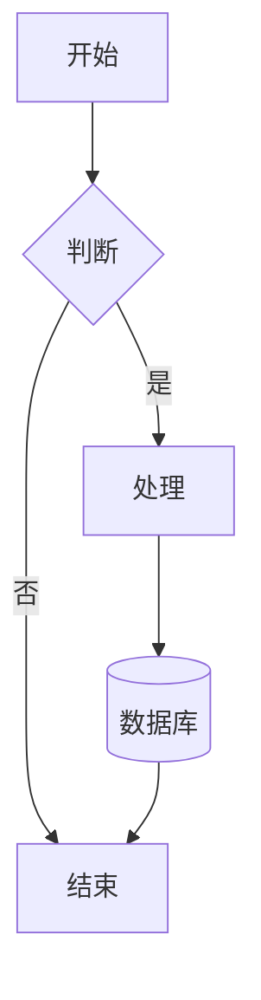

# 主题系统

mermaid-canvas-rs 的主题系统通过**节点形状传递语义信息**，颜色与形状类型绑定而非单个节点独立着色。这种设计符合行业最佳实践，确保图表的一致性和可读性。

## 设计理念

### 同形状同色，颜色传递语义

传统的图表工具往往允许对每个节点独立设置颜色，虽然灵活但容易造成视觉混乱。mermaid-canvas-rs 采用**形状驱动的配色方案**：

- **相同形状 = 相同颜色**：所有矩形节点共享 primary 颜色，所有菱形节点共享 accent 颜色
- **颜色传递语义**：用户通过颜色快速识别节点类型（判断节点永远是菱形且 accent 色）
- **6 个语义色槽**：覆盖所有节点形状，主题只需定义 6 个颜色

### 与行业实践一致

这种设计借鉴了专业图表软件的实践：

- **Microsoft Visio**：形状库按功能分类，同类形状共享配色
- **draw.io**：预设主题按形状类型统一配色
- **Mermaid 官方**：主题配置中形状样式与颜色绑定

### 优势

1. **视觉一致性**：相同功能的节点始终保持相同的颜色
2. **快速识别**：用户无需标签即可识别节点类型
3. **主题切换简单**：更换主题只需改变 6 个色槽的定义
4. **符合认知习惯**：菱形代表判断、圆形代表起止等语义得到颜色强化

## 形状→色槽映射

mermaid-canvas-rs 将 12 种节点形状归入 6 个语义色槽：

| 色槽 | 节点形状 | 语义描述 | 示例场景 |
|------|----------|----------|----------|
| **primary** | Rectangle, RoundRect, Stadium | 普通流程节点 | 操作步骤、处理过程 |
| **secondary** | Subroutine | 子流程 | 调用子程序、嵌套流程 |
| **accent** | Diamond | 判断/分支 | 条件判断、决策点 |
| **info** | Circle, DoubleCircle | 起止/连接 | 开始/结束节点、连接点 |
| **data** | Cylinder | 数据存储 | 数据库、文件存储 |
| **special** | Hexagon, Parallelogram, Trapezoid, Asymmetric | 特殊处理 | 准备步骤、输入输出、手动操作 |

### shape_slot 函数

核心映射逻辑在 `shape_slot` 函数中实现：

```rust
use mermaid_canvas_component::theme::shape_slot;
use mermaid_canvas_core::NodeShape;

// 同语义组 → 同色槽
assert_eq!(shape_slot(&NodeShape::Rectangle), 0);
assert_eq!(shape_slot(&NodeShape::RoundRect), 0);
assert_eq!(shape_slot(&NodeShape::Stadium), 0);

// 不同语义组 → 不同色槽
assert_ne!(shape_slot(&NodeShape::Rectangle), shape_slot(&NodeShape::Diamond));
```

## 内置主题

mermaid-canvas-rs 提供 5 个内置主题，覆盖常见的使用场景。

| 主题 | 风格描述 | primary 颜色 | 适用场景 |
|------|----------|-------------|----------|
| **Default** | 经典浅色，明亮清透 | `#dae8fc` (蓝) | 一般文档、报告 |
| **Dark** | 深色冷调，护眼舒适 | `#313244` (深蓝灰) | 深色模式应用、夜间浏览 |
| **Forest** | 森林深绿，自然清新 | `#2d5a27` (深绿) | 环保主题、户外场景 |
| **Nordic** | 北欧极简，冷灰蓝+淡粉 | `#dfe6ed` (冷蓝灰) | 极简设计、现代 UI |
| **Cappuccino** | 卡布奇诺，暖棕奶咖 | `#e8d5c4` (奶咖) | 暖色调主题、复古风格 |

### Default 主题

```rust
// 经典浅色主题
impl Theme for DefaultTheme {
    fn name(&self) -> &str { "Default" }
    fn background_color(&self) -> &str { "#ffffff" }
    fn node_stroke(&self) -> &str { "#6c8ebf" }
    fn node_text_color(&self) -> &str { "#333333" }
    // ... 6 色槽定义
}

const PALETTE: [&'static str; 6] = [
    "#dae8fc", // primary: 蓝
    "#e1d5e7", // secondary: 紫
    "#fff2cc", // accent: 黄
    "#d5e8d4", // info: 绿
    "#f8cecc", // data: 红
    "#fff2cc", // special: 黄
];
```

### Dark 主题

```rust
const PALETTE: [&'static str; 6] = [
    "#313244", // primary: 深蓝灰
    "#45475a", // secondary: 中灰
    "#3b3b55", // accent: 深紫灰
    "#2a3a4a", // info: 深蓝
    "#3a2a2a", // data: 深红棕
    "#3b3b55", // special: 深紫灰
];
```

### Forest 主题

```rust
const PALETTE: [&'static str; 6] = [
    "#2d5a27", // primary: 深绿
    "#3a6b34", // secondary: 中绿
    "#4a7c3f", // accent: 亮绿
    "#1e4d2b", // info: 暗绿
    "#5a3a27", // data: 棕绿
    "#3a6b34", // special: 中绿
];
```

### Nordic 主题

```rust
const PALETTE: [&'static str; 6] = [
    "#dfe6ed", // primary: 冷蓝灰
    "#e8edf2", // secondary: 浅蓝灰
    "#f0e6ec", // accent: 淡粉
    "#e2e8f0", // info: 蓝灰
    "#e0ddd8", // data: 暖灰
    "#ede9e6", // special: 米灰
];
```

### Cappuccino 主题

```rust
const PALETTE: [&'static str; 6] = [
    "#e8d5c4", // primary: 奶咖
    "#dcc8b4", // secondary: 浅棕
    "#f0e0d0", // accent: 奶白
    "#d4b896", // info: 焦糖
    "#c9a882", // data: 深焦糖
    "#e0cdc0", // special: 米棕
];
```

## 使用方式

### Native 路径

直接在 Rust 代码中使用内置主题：

```rust
use mermaid_canvas_wit;

let source = "flowchart TD\n    A[Start] --> B{Choice?} --> C[(DB)]";

// 使用默认主题
let result = mermaid_canvas_wit::render(source, None)?;

// 或指定主题名称
let result = mermaid_canvas_wit::render(source, Some("dark"))?;

// 所有可选主题
let themes = ["default", "dark", "forest", "nordic", "cappuccino"];
```

### WASM Component 路径

通过 WIT 接口使用 WASM 组件：

```bash
# 构建组件
cargo build -p mermaid-canvas-wit-wasm --target wasm32-wasip2 --release

# 使用 WASM 路径渲染
cargo run --bin demo-flowchart -- \
  --wasm target/wasm32-wasip2/release/mermaid_canvas_wit_wasm.wasm \
  --theme forest \
  --output flowchart.png
```

### 命令行示例

```bash
# 使用不同主题渲染同一图表
for theme in default dark forest nordic cappuccino; do
    cargo run --bin demo-flowchart -- --theme $theme --output ${theme}.png
done
```

## 自定义主题

实现 `Theme` trait 即可创建自定义主题，只需定义 6 个色槽。

### 主题 trait

```rust
use mermaid_canvas_core::{NodeShape, style::FillStyle};
use mermaid_canvas_component::{Theme, Margin};

pub trait Theme {
    fn name(&self) -> &str;
    fn background_color(&self) -> &str;
    fn font_family(&self) -> &str;
    fn font_size(&self) -> f64;

    // 核心：按形状类型返回颜色
    fn node_fill_color(&self, shape: &NodeShape) -> &str;

    fn node_fill(&self, shape: &NodeShape) -> FillStyle {
        FillStyle::Color(self.node_fill_color(shape).to_string())
    }

    // 其他样式配置
    fn node_stroke(&self) -> &str;
    fn node_text_color(&self) -> &str;
    fn edge_color(&self) -> &str;
    fn edge_label_background(&self) -> &str;
    fn subgraph_background(&self) -> &str;
    fn subgraph_border(&self) -> &str;
    fn title_color(&self) -> &str;
    fn margin(&self) -> Margin;
}
```

### 自定义主题示例

```rust
use mermaid_canvas_core::{NodeShape, style::FillStyle};
use mermaid_canvas_component::{Theme, Margin};

/// 紫色主题
pub struct PurpleTheme;

impl PurpleTheme {
    // 定义 6 个色槽
    const PALETTE: [&'static str; 6] = [
        "#e0d4fc", // primary: 淡紫
        "#d0c4f0", // secondary: 紫灰
        "#f0e0ff", // accent: 亮紫
        "#d0b0e0", // info: 暗紫
        "#f0c0d0", // data: 粉紫
        "#e8d0f0", // special: 紫粉
    ];
}

impl Theme for PurpleTheme {
    fn name(&self) -> &str { "Purple" }
    fn background_color(&self) -> &str { "#faf8fc" }
    fn font_family(&self) -> &str { "sans-serif" }
    fn font_size(&self) -> f64 { 14.0 }

    fn node_fill_color(&self, shape: &NodeShape) -> &str {
        let slot = mermaid_canvas_component::theme::shape_slot(shape);
        Self::PALETTE[slot]
    }

    fn node_fill(&self, shape: &NodeShape) -> FillStyle {
        FillStyle::Color(self.node_fill_color(shape).to_string())
    }

    fn node_stroke(&self) -> &str { "#9b7dd0" }
    fn node_text_color(&self) -> &str { "#4a2c6a" }
    fn edge_color(&self) -> &str { "#8b6db0" }
    fn edge_label_background(&self) -> &str { "#faf8fc" }
    fn subgraph_background(&self) -> &str { "#f4f0f8" }
    fn subgraph_border(&self) -> &str { "#c0a8e0" }
    fn title_color(&self) -> &str { "#4a2c6a" }
    fn margin(&self) -> Margin { Margin::all(20.0) }
}
```

### 使用自定义主题

```rust
use mermaid_canvas_component::{Theme, LayoutConfig};
use mermaid_canvas_core::parse_mermaid;

// 自定义主题
let theme = PurpleTheme;
let config = LayoutConfig::default();
let ast = parse_mermaid(source)?;

// 计算布局（使用自定义主题）
let layout = mermaid_canvas_component::compute_layout(&ast, &theme, &config);

// 渲染（使用自定义主题）
let output = mermaid_canvas_component::FlowchartRenderer::render(&layout, &theme)?;
```

## 示例：不同主题下的相同流程图

### 基础流程图



### Default 主题

```
颜色映射：
- 开始/结束 (Stadium): primary (#dae8fc) - 蓝色
- 处理 (RoundRect): primary (#dae8fc) - 蓝色
- 判断 (Diamond): accent (#fff2cc) - 黄色
- 数据库 (Cylinder): data (#f8cecc) - 红色
```

### Dark 主题

```
颜色映射：
- 开始/结束 (Stadium): primary (#313244) - 深蓝灰
- 处理 (RoundRect): primary (#313244) - 深蓝灰
- 判断 (Diamond): accent (#3b3b55) - 深紫灰
- 数据库 (Cylinder): data (#3a2a2a) - 深红棕
```

### Forest 主题

```
颜色映射：
- 开始/结束 (Stadium): primary (#2d5a27) - 深绿
- 处理 (RoundRect): primary (#2d5a27) - 深绿
- 判断 (Diamond): accent (#4a7c3f) - 亮绿
- 数据库 (Cylinder): data (#5a3a27) - 棕绿
```

### Nordic 主题

```
颜色映射：
- 开始/结束 (Stadium): primary (#dfe6ed) - 冷蓝灰
- 处理 (RoundRect): primary (#dfe6ed) - 冷蓝灰
- 判断 (Diamond): accent (#f0e6ec) - 淡粉
- 数据库 (Cylinder): data (#e0ddd8) - 暖灰
```

### Cappuccino 主题

```
颜色映射：
- 开始/结束 (Stadium): primary (#e8d5c4) - 奶咖
- 处理 (RoundRect): primary (#e8d5c4) - 奶咖
- 判断 (Diamond): accent (#f0e0d0) - 奶白
- 数据库 (Cylinder): data (#c9a882) - 深焦糖
```

### 关键观察

1. **形状一致**：所有主题中菱形都是判断，圆柱都是数据库
2. **色槽一致**：同语义组的形状在所有主题中颜色不同但色槽相同
3. **可预测性**：用户通过形状而非颜色识别语义，主题只改变视觉风格
4. **语义强化**：颜色进一步强化形状的语义，提高可读性

### 实际渲染对比

```bash
# 渲染所有主题的对比图
cargo run --bin demo-themes -- --output ./themes

# 输出：
# themes/default.png
# themes/dark.png
# themes/forest.png
# themes/nordic.png
# themes/cappuccino.png
```

所有渲染图中：
- 判断节点永远是菱形（accent 色槽）
- 数据库节点永远是圆柱（data 色槽）
- 主题只改变具体的颜色值，不改变语义映射
