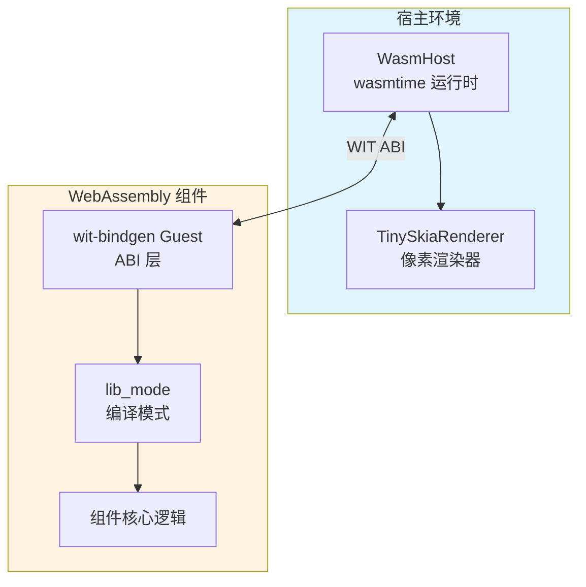
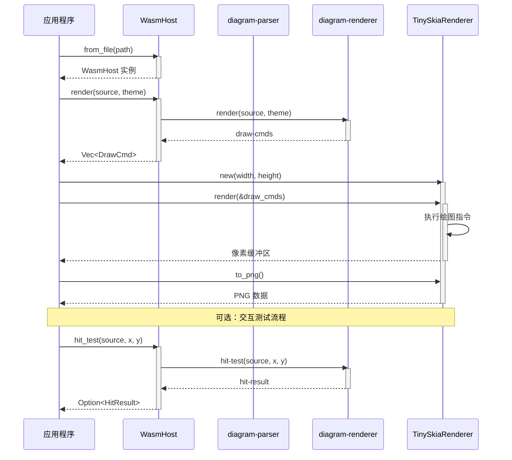

# WebAssembly 集成

mermaid-canvas-rs 编译为符合 WASI Component Model 标准的 WebAssembly 组件，可通过 WIT ABI 与宿主环境互操作。

## 架构概览



## 编译

### 构建命令

```bash
cargo build --release --target wasm32-wasip2
```

### 输出路径

```
target/wasm32-wasip2/release/mermaid_canvas_viz.wasm
```

### 组件大小

Release 模式编译后的组件大小约为 **1.7MB**。

### 目标配置表

| 配置项 | 值 | 说明 |
|--------|---|------|
| 目标架构 | wasm32-wasip2 | WASI Preview 2 目标 |
| WIT 世界 | mermaid-canvas-viz | 组件世界名称 |
| 包名称 | mermaid-canvas:viz | WIT 包标识符 |
| 依赖 | 无外部导入 | 纯计算型组件 |

## WIT 接口

### diagram-parser 接口

提供 Mermaid 图表源码解析功能：

```wit
interface diagram-parser {
    /// 解析 Mermaid 图表源码
    /// 返回解析后的图形数据
    parse: func(source: string) -> result<diagram-data, string>
}
```

### diagram-renderer 接口

提供图表渲染和交互测试功能：

```wit
interface diagram-renderer {
    /// 渲染图表为绘图指令序列
    render: func(source: string, theme: theme) -> result<draw-cmds, string>

    /// 测试点是否命中图形元素
    hit-test: func(source: string, x: f32, y: f32) -> result<hit-result, string>
}
```

### WIT 世界定义

```wit
package mermaid-canvas:viz;

world mermaid-canvas-viz {
    export diagram-parser;
    export diagram-renderer;
}
```

**注意**：WIT 接口中使用 `source` 和 `target` 作为字段名，避免使用 WIT 关键字 `from` 和 `to`。

### 生成的类型

`wasmtime bindgen` 根据上述 WIT 定义生成 `MermaidCanvasViz` 结构体，包含两个接口的所有功能。

## 宿主端使用

### 加载组件

```rust
use mermaid_canvas_host::{WasmHost, TinySkiaRenderer};
use wasmtime::Engine;

// 从文件加载组件
let engine = Engine::default();
let host = WasmHost::from_file(&engine, "path/to/mermaid_canvas_viz.wasm")?;
```

### 渲染图表

```rust
let source = r#"
graph TD
    A[开始] --> B{决策}
    B -->|是| C[执行]
    B -->|否| D[结束]
    C --> D
"#;

// 渲染为绘图指令
let theme = Theme::Default;
let draw_cmds = host.render(source, theme)?;

// 转换为像素输出
let mut renderer = TinySkiaRenderer::new(800, 600);
renderer.render(&draw_cmds)?;
let png_data = renderer.to_png()?;
```

### 命中测试

```rust
// 测试坐标 (400, 300) 是否命中图形元素
let hit_result = host.hit_test(source, 400.0, 300.0)?;

if let Some(node_id) = hit_result.node_id {
    println!("命中节点: {}", node_id);
}
```

## 类型编码

### DrawCmd 编码

| 命令类型 | 编码 | 参数 |
|---------|------|------|
| BeginPath | 0 | - |
| MoveTo | 1 | x, y |
| LineTo | 2 | x, y |
| QuadCurve | 3 | cx, cy, x, y |
| CubicCurve | 4 | c1x, c1y, c2x, c2y, x, y |
| ClosePath | 5 | - |
| Fill | 6 | color |
| Stroke | 7 | color, width |
| Text | 8 | x, y, text, anchor, baseline, size, color |
| Clip | 9 | - |

### Path 段编码

| 类型 | 编码 | 参数数量 |
|------|------|---------|
| Move | 0 | 2 (x, y) |
| Line | 1 | 2 (x, y) |
| Quad | 2 | 4 (cx, cy, x, y) |
| Cubic | 3 | 6 (c1x, c1y, c2x, c2y, x, y) |
| Close | 4 | 0 |

### 文本对齐编码

**Anchor（水平对齐）**：

| 值 | 含义 |
|----|------|
| 0 | Start（左对齐） |
| 1 | Middle（居中） |
| 2 | End（右对齐） |

**Baseline（垂直对齐）**：

| 值 | 含义 |
|----|------|
| 0 | Top（顶对齐） |
| 1 | Middle（垂直居中） |
| 2 | Alphabetic（字母基线） |
| 3 | Bottom（底对齐） |

## 完整调用流程



## 性能特性

- **无外部依赖**：组件不导入任何外部 WASM 模块，确保完全可移植性
- **快速解析**：Mermaid 解析器在 WebAssembly 中运行，性能接近原生
- **紧凑编码**：DrawCmd 使用高效的二进制编码，最小化序列化开销
- **按需渲染**：支持增量渲染和局部重绘，适合交互式应用

## 相关资源

- [WASI Component Model 规范](https://component-model.bytecodealliance.org/)
- [WIT 接口定义语言](https://component-model.bytecodealliance.org/design/wit.html)
- [wit-bindgen 文档](https://github.com/bytecodealliance/wit-bindgen)
